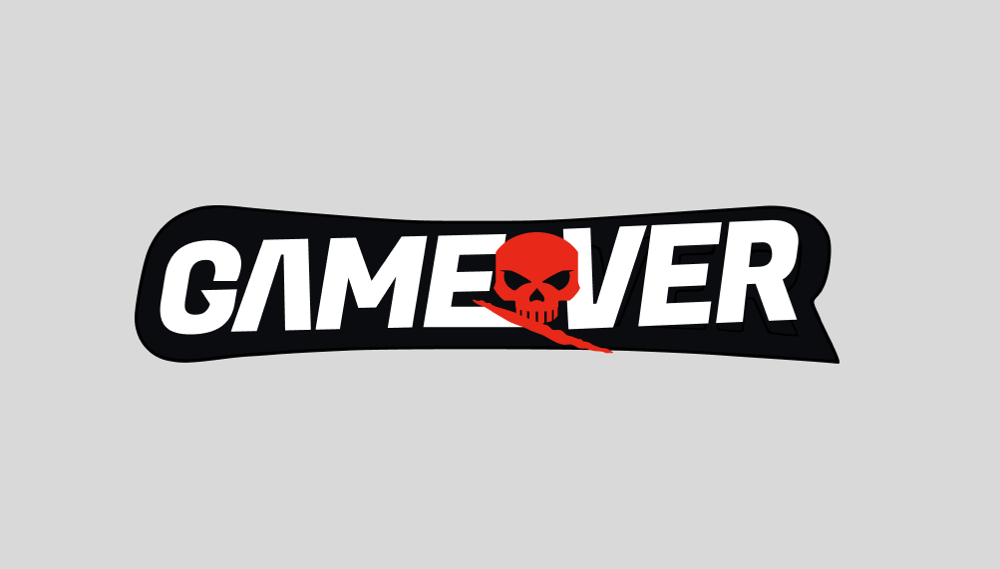

# Gameover Client



A React + TypeScript frontend built with Vite for the Gameover sports league experience.

Gameover is a TypeScript-powered fantasy basketball backend with a React frontend. It combines secure Express APIs, PostgreSQL via drizzle-orm, NBA data routing, and league management features for sign-in, drafts, rosters, memberships, and team trades.

## Overview

This repo contains the client-side application for a sports league UI. It uses modern frontend tooling and design tokens to deliver a fast development workflow and consistent styling.

## Key technologies

- Vite
- React 19
- TypeScript 6
- Tailwind CSS 4
- Style Dictionary
- Path aliases for cleaner imports

## Scripts

- `npm run dev` — start the Vite development server
- `npm run build` — compile TypeScript and build the production bundle
- `npm run preview` — preview the production build locally
- `npm run lint` — run ESLint across the project
- `npm run token` — generate design tokens via Style Dictionary

## Project structure

- `src/main.tsx` — application entry point
- `src/app.tsx` — root app component
- `src/config/` — app configuration and global settings
- `src/design/` — design system and token CSS
- `src/component/` — reusable UI components
- `src/locale/` — translation and locale resources
- `src/utility/` — shared helper functions and utilities
- `src/typing/` — global type definitions

## Path aliases

This app uses aliases for cleaner imports.

### TypeScript aliases (`tsconfig.app.json`)

- `app` → `src/app.tsx`
- `gameover/*` → `src/config/*`
- `gameover.design` → `src/design/token/css/global.css`

### Vite aliases (`vite.config.ts`)

- `app` is mapped directly to `src/app.tsx`
- `gameover/*` is mapped to `src/config/$1`
- `gameover.design` is mapped to `src/design/token/css/global.css`

> If you add or change alias paths, update both `tsconfig.app.json` and `vite.config.ts` so TypeScript and Vite stay in sync.

## Development

1. Install dependencies:
   ```bash
   npm install
   ```
2. Start the dev server:
   ```bash
   npm run dev
   ```
3. Open the app in the browser at the URL shown by Vite.

## Build and preview

```bash
npm run build
npm run preview
```

## Notes

- The project currently uses `vite.config.ts` for alias resolution, so `import App from 'app'` resolves correctly to `src/app.tsx`.
- The design token CSS entry is imported via `gameover.design`, which points at the global theme CSS file.
- Use `npm run token` whenever design tokens change.
